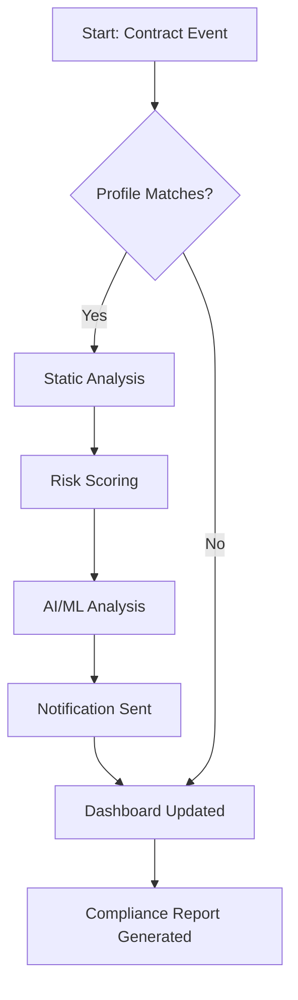

# 🤖 ClarityGuard: Smart Contract Security & Insights Engine

*Secure your decentralized future with dynamic, real-time smart contract monitoring and compliance auditing for Stacks Clarity deployments! Featuring seamless automation, multi-framework integration, and AI-powered insights for developers and enterprises.*  

---

## 📝 Overview

**ClarityGuard** is a powerful toolkit crafted for the next evolution of blockchain contract engineering. Inspired by the growing needs in the Clarity ecosystem for smart contract monitoring, real-time alerts, and compliance health checks, ClarityGuard offers:

- Plug-and-play scanning for Clarity contracts on the Stacks blockchain.
- Robust risk scoring, security compliance, and anomaly detection.
- Deep AI-driven analytics utilizing OpenAI and Claude API integrations.
- Human-friendly, customizable dashboards with multilingual support.
- Designed for relentless reliability: ClarityGuard is always on call.

If you're ready to supercharge your contract lifecycle with continuous auditing, actionable insights, and industry-leading automation, ClarityGuard is your toolkit for 2026 and beyond!

---

## 🛠️ Features at a Glance

- **Instant Security Audits:** Unprecedented automated vulnerability detection using advanced Clarity static analysis and behavior mapping.
- **Dynamic Compliance Checker:** Stay one step ahead of regulatory and community standards.
- **AI-Assisted Reports:** Harness generative AI (OpenAI, Claude) for contract summaries, risk explanations, and proactive suggestions.
- **Customizable Profiles:** Deploy tailored monitoring setups for different users, teams, or projects.
- **Insightful Dashboards:** Lightning-fast, real-time updates on contract health, risk posture, and compliance from anywhere.
- **Seamless Integration:** Direct import/export with stacks-blockchain, Clarity tools, and enterprise data feeds.
- **Responsive, Multilingual UI:** Built from scratch for accessibility; supports English, 中文, Español, फ्रançais, العربية, and more.
- **24/7 Support:** Around-the-clock onboarding and troubleshooting via smart in-app chat and global community channels.

---

## 📦 Download

Get started with ClarityGuard!  
  

---

## 🗂️ Table of Contents

- Overview
- Feature List
- Example Profile Configuration
- Example Console Invocation
- Mermaid Diagram
- OS Compatibility Table
- Integration Highlights
- How to Use
- License
- Disclaimer

---

## 🚀 Example Profile Configuration

Here's a typical YAML configuration for a compliance-focused enterprise profile. Profiles define targets, notification preferences, audit parameters, and language settings.

    profile:
      name: Enterprise Compliance
      contracts:
        - address: SP3C2X…
          alias: "TokenManager"
        - address: SP7HG1…
          alias: "VotingCore"
      notifications:
        slack: "compliance-alerts"
        email: "security-team@company.com"
      audit:
        interval: "5min"
        checks:
          - "reentrancy"
          - "overflow"
          - "permission-denied"
      ai_analysis:
        provider: "openai"
        explain: true
        language: "fr"
      ui:
        theme: "dark"
        locale: "fr"

---

## 💻 Example Console Invocation

You can run ClarityGuard via CLI with just a single command:

    clarityguard scan --profile config/enterprise.yaml

Or, for a quick scan with AI summaries:

    clarityguard scan --contract SP3C2X... --ai-summary --lang zh

---

## 📊 Mermaid Diagram

The life cycle of a contract audit from Detection to Compliance Report.

---

## 🌍 Emoji OS Compatibility Table

| Operating System     | Supported | Emoji |
|---------------------|:---------:|:-----:|
| Ubuntu Linux        |   ✅      | 🐧    |
| macOS (Apple Silicon & Intel) | ✅ | 🍏    |
| Windows 10/11       |   ✅      | 🖥️    |
| Debian/Arch Linux   |   ✅      | 🚀    |
| Raspberry Pi OS     |   ⚠️      | 🍓    |
| Android Termux      |   🟡      | 🤖    |

---

## ✨ SEO-Focused Feature List

- **Automated Smart Contract Auditor** for Stacks Clarity
- **Real-Time Blockchain Monitoring** for rapid incident response
- **Continuous Security Assessment** with compliance checks
- **AI-Enhanced Insights** offers next-gen contract documentation
- **Risk Profile Dashboards** to visualize contract health
- **Enterprise-Ready CI/CD Integration** for smart contract workflows
- **Cross-Platform Support** for advanced developer productivity
- **Multilingual & Accessible Interface** for global teams
- **OpenAI & Claude API Integration** for analytics and summarization
- **Dedicated, Always-On Customer Service**, powered by smart chatbot

---

## 🤖 OpenAI & Claude API Integration

Harness the full might of LLMs in your contract pipeline!  
ClarityGuard utilizes OpenAI’s GPT model and Anthropic’s Claude for:

- Real-time bug explanation and remediation steps
- Natural-language compliance report generation
- Risk summaries tailored to role and region
- Dialog-based support, 24/7, within the admin dashboard

API keys are securely managed and never logged or transmitted.

---

## 🌈 Responsive UI & Multilingual Support

ClarityGuard’s web interface is optimized for all devices and screen sizes. Select from multiple languages at runtime and adapt reports or notifications to the chosen locale—perfect for international collaborative teams.

---

## 🔗 24/7 Customer Support

- In-app smart chat for rapid troubleshooting, documentation, and onboarding.
- Global Slack/Discord community.
- Service level objectives tailored to enterprise needs.
- Smart contract and compliance experts never farther than a click away, every day of the year.

---

## 📋 License

ClarityGuard is released under the MIT license. See [MIT License](LICENSE) for details.

---

## ⚠️ Disclaimer

ClarityGuard provides advanced automated auditing, diagnostics, and compliance tools for Stacks Clarity smart contracts. However, no software can guarantee full protection or legal compliance. Final deployment security is the responsibility of users. ClarityGuard should be used in conjunction with regular manual reviews and up-to-date ethical best practices.  
*(c) 2026 — All rights reserved.*

---

## 📦 Download Again

Ready to secure your Clarity contracts?  

---

Looking for next-generation smart contract security, actionable compliance, and human-centered AI insights? ClarityGuard: Your digital guardian in the world of decentralized contracts.